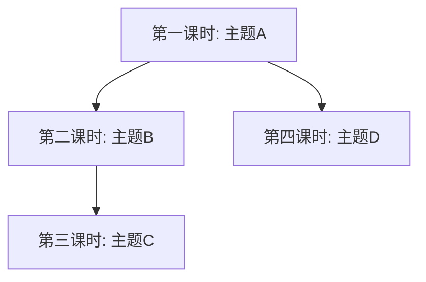

# 模式 B：期末复习速览 — 详细模板

## 适用场景

有多课时/多章节的学习材料，需要浓缩为考前快速翻阅的复习指南。

## 输出结构

### 知识图谱

使用 Mermaid 绘制要素间的关系：



标签简洁，箭头标注关系类型（"影响""发展""对立""继承"）。

### 考点清单

按重要性排序：

```markdown
- [ ] **考点名称**（⭐⭐⭐）
  - **考察方式**：[名词解释/简答/论述/材料分析]
  - **核心要点**：[2~3 句总结]
  - **对应要素**：[相关概念/人物/成果]
```

### 要素对照速查表

对跨课时的同类要素做横向表格：

```markdown
| 维度 | 要素A | 要素B | 要素C |
|------|-------|-------|-------|
| 时间/年代 | | | |
| 代表作/文本 | | | |
| 核心主张 | | | |
| 一句话 | | | |
| 影响/局限 | | | |
```

### 简答/论述模板

针对考试常见题型，给出模板化回答要点：

```markdown
### 1. [题目]

**答题要点**：
1. [要点1 — 概念界定 + 代表人物]
2. [要点2 — 核心观点 + 例证]
3. [要点3 — 影响/评价]

**模板回答**：
[2~3 句话的示例]

**同类题**：[变体题目]
```

### 考前最后一页

用最精炼的语言总结全部内容，适合考前 5 分钟翻阅：

```markdown
## 考前最后一页

### 核心要素一句话串讲
- **[要素1]**：[一句话]
- **[要素2]**：[一句话]

### 关键概念速览
- **[概念1]**：[一句话定义]

### 易混淆对比
- **A vs B**：[区分要点]

### 时间线/分期速记
- **[时期1]** → **[时期2]** → **[时期3]**
```

考前最后一页的原则：不说任何多余的话，每行最大信息密度。

## 完整合并结构

```
# 课程名称 - 期末复习速览

## 知识图谱
## 考点清单
## 要素对照速查
### [主题1 对比表]
### [主题2 对比表]

## 简答/论述模板
1. [题目1] → 答题要点 + 模板回答
2. [题目2] → 答题要点 + 模板回答

## 考前最后一页
### 一句话串讲
### 概念速览
### 易混淆对比
### 时间线速记
```

